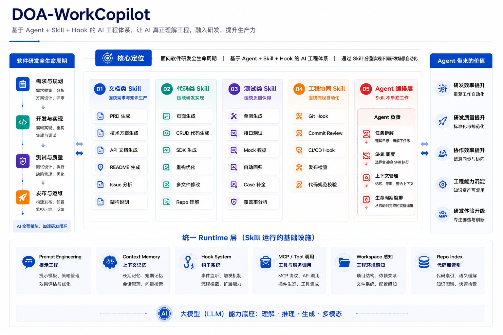
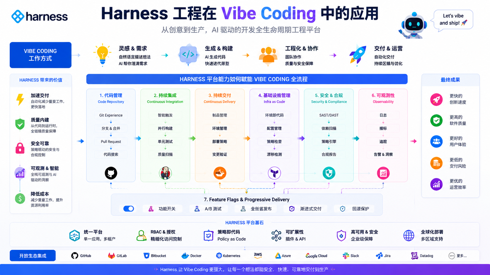

<div align="center">

# 🏗️ DOA WorkCopilot

### 项目全生命周期工作站

> *"Tell the AI what you want to build, then grab a coffee."* ☕

统一编排 Agent + Skill + Hook，从项目初始化到交付的一站式 AI 辅助开发工作流

<br>

[](LICENSE)
&nbsp;
[](https://github.com/KeatsLee/doa-workcopilot)
&nbsp;

&nbsp;


</div>

<br>

<p align="center">
  
</p>

---

## 💡 这是什么？

你是否厌倦了每次新项目都要手动搭脚手架、写模板、配工具链？

**DOA WorkCopilot** 让 AI 成为你的项目副驾驶 —— 从第一行需求到最终交付，全程陪跑。

<div align="center">

```
💬 "开始新项目"
      ↓
📋 需求分析  →  🏛️ 系统设计  →  📝 任务拆解
      ↓               ↓               ↓
🧱 脚手架搭建  →  💻 开发  →  🧪 测试
      ↓               ↓               ↓
📄 文档生成  →  📦 交付  →  🎉 Done!
```

</div>

### ✨ 为什么选择它？

<table>
<tr>
<td width="50%">

**🧩 自包含设计**

所有 Agent、Skill、Hook、Prompt 模板打包在一个目录中。拷贝即用，无外部依赖。

</td>
<td width="50%">

**🚀 一键部署**

PowerShell 脚本自动安装到 `~/.claude/` 目录结构。  
3 秒完成，0 配置。

</td>
</tr>
<tr>
<td>

**💉 项目注入**

初始化项目时自动注入 Agent、Skill、Hook 到项目目录。新老项目都能接。

</td>
<td>

**💾 自动持久化**

每次会话结束自动更新 `.workcopilot/` 下的项目状态文件。下次继续，无缝衔接。

</td>
</tr>
</table>

---

## 🚀 快速开始

> [!TIP]
> 只需两条命令，即可完成安装 👇

```powershell
# 1️⃣ 克隆仓库
git clone https://github.com/KeatsLee/doa-workcopilot.git

# 2️⃣ 运行部署脚本
& "./doa-workcopilot/scripts/deploy.ps1"
```

脚本会自动完成：

| 步骤 | 操作 |
|:----:|------|
| ① | 将 Skill 安装到 `~/.claude/skills/doa-workcopilot/` |
| ② | 在 `~/.claude/agents/` 安装 **6** 个 Agent 文件 |
| ③ | 在 `~/.claude/skills/` 安装 **12** 个附属 Skill |

<details>
<summary>📦 手动安装（展开）</summary>

1. 复制 `doa-workcopilot/` 到 `~/.claude/skills/`
2. 复制 `embedded-agents/` 下的 `.md` 文件到 `~/.claude/agents/`
3. 复制 `embedded-skills/` 下的子目录到 `~/.claude/skills/`

</details>

### 🎯 使用

在 Claude / Copilot Chat 中输入以下触发词之一：

```
开始新项目 / 接手老项目 / workcopilot / 项目启动 / scaffold project
```

> [!NOTE]
> WorkCopilot 会自动识别当前目录是新项目还是已有项目，并引导进入对应的工作流。

---

## 🤖 Agent 团队

你的 AI 开发团队，各司其职：

<div align="center">

| 角色 | 职责 | 擅长 |
|:----:|------|------|
| 🔍 **需求分析师** | 需求拆解 & 用户故事 | 把模糊想法变成清晰需求 |
| 🏛️ **系统架构师** | 技术选型 & 架构设计 | 画出优雅的系统蓝图 |
| ⚙️ **后端工程师** | API & 业务逻辑 | .NET / Python 后端开发 |
| 🎨 **前端工程师** | UI & 交互 | React / HTML 前端开发 |
| 🧪 **测试工程师** | 测试策略 & 用例 | 让 Bug 无处藏身 |
| 📊 **图表专家** | Mermaid 图 | 把复杂逻辑画出来 |

</div>

---

## 🧰 附属 Skill 全景

<div align="center">

```
                    ┌──────────────────────────────────┐
                    │       DOA WorkCopilot 主编排       │
                    └──────────┬───────────────────────┘
           ┌──────────────────┼──────────────────┐
           ▼                  ▼                  ▼
    ┌──────────────┐  ┌──────────────┐  ┌──────────────┐
    │   📄 文档类   │  │   🧪 测试类   │  │   🎨 设计类   │
    ├──────────────┤  ├──────────────┤  ├──────────────┤
    │ doa-ppt      │  │ doa-e2etest  │  │frontend-design│
    │ doa-metting  │  │ doa-testreport│ │ui-ux-pro-max │
    │ doa-apidoc   │  │ brainstorming│  └──────────────┘
    │ doa-quotation│  └──────────────┘         ▲
    │ doa-image    │                           │
    └──────────────┘  ┌──────────────┐         │
                      │   ⚙️ 工程类   │─────────┘
                      ├──────────────┤
                      │ doa-harness  │
                      │spec-flow-main│
                      └──────────────┘
```

</div>

<details>
<summary>📖 Skill 详细说明（点击展开）</summary>

| 分类 | Skill | 功能 |
|:----:|-------|------|
| 📄 | `doa-ppt` | HTML → PPTX/PDF 商务演示文稿，多主题 + 截图高保真/可编辑两种模式 |
| 📄 | `doa-metting` | 会议纪要生成，输出 PDF |
| 📄 | `doa-apidoc` | API 接口文档，支持 PDF / Word |
| 📄 | `doa-quotation` | 项目工时报价 / 敏捷任务拆分 Excel |
| 📄 | `doa-image` | 图片生成与处理 |
| 🧪 | `doa-e2etest` | Playwright E2E 测试编写指导 |
| 🧪 | `doa-testreport` | 测试报告生成 |
| 🧪 | `brainstorming` | 创意头脑风暴工作流 |
| 🎨 | `frontend-design` | 高质量前端界面设计 |
| 🎨 | `ui-ux-pro-max` | UI/UX 设计智能体（50+ 风格 · 21 配色 · 9 技术栈） |
| ⚙️ | `doa-harness` | Harness Engineering 工程轨道初始化 |
| ⚙️ | `spec-flow-main` | 交互式 Spec 驱动开发流程 |

</details>

---

## 📐 Harness 工程轨道

> *给 Vibe Coding 装上护栏 🛤️*

<p align="center">
  
</p>

---

## 📁 目录结构

<details>
<summary>展开查看完整目录</summary>

```
doa-workcopilot/
├── SKILL.md                        ← 主编排逻辑
├── LICENSE                         ← Apache 2.0
├── scripts/
│   └── deploy.ps1                  ← 一键部署脚本
├── references/                     ← 脚手架模板 & 工作流参考
├── embedded-agents/                ← 6 个 Agent 角色定义
│   ├── requirements-analyst.md
│   ├── system-architect.md
│   ├── backend-engineer.md
│   ├── frontend-engineer.md
│   ├── test-engineer.md
│   └── mermaid-diagram.md
├── embedded-hooks/                 ← PreToolUse Hook
├── embedded-prompts/               ← Prompt 模板
│   ├── code-review.prompt.md
│   └── generate-tests.prompt.md
└── embedded-skills/                ← 12 个附属 Skill
    ├── brainstorming/
    ├── doa-apidoc/
    ├── doa-e2etest/
    ├── doa-harness/
    ├── doa-image/
    ├── doa-metting/
    ├── doa-ppt/
    ├── doa-quotation/
    ├── doa-testreport/
    ├── frontend-design/
    ├── spec-flow-main/
    └── ui-ux-pro-max/
```

</details>

---

## 🎨 品牌定制

`doa-ppt` 和 `doa-quotation` 支持自定义品牌模板。将品牌素材放入对应的 `brand-assets/` 目录：

```
embedded-skills/doa-ppt/brand-assets/
├── Home_Logo.png                  ← 白色 Logo（封面用）
├── Content_Logo.png               ← 深色 Logo（内容页用）
└── BackGround_Decoration.png      ← 装饰图（可选）

embedded-skills/doa-quotation/brand-assets/
└── company_logo.png               ← 报价单 Logo
```

> [!WARNING]
> `brand-assets/` 目录已在 `.gitignore` 中排除，不会提交到仓库。请自行备份品牌素材。

---

## 📜 第三方许可

| 组件 | 许可证 | 链接 |
|------|--------|------|
| spec-flow-main | MIT License, Copyright (c) 2026 echoVic | [LICENSE](embedded-skills/spec-flow-main/LICENSE) |
| frontend-design | 见文件 | [LICENSE.txt](embedded-skills/frontend-design/LICENSE.txt) |

---

<div align="center">

## 📄 许可证

[Apache License 2.0](LICENSE) · Copyright 2026 KeatsLee

---

*Made with ❤️ and a lot of ☕ by [KeatsLee](https://github.com/KeatsLee)*

</div>
